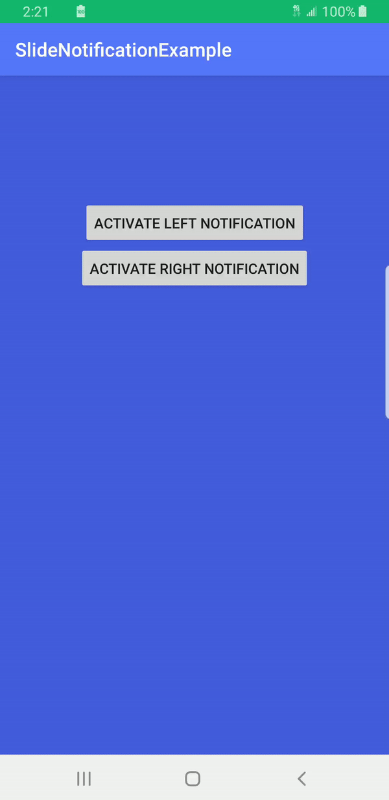
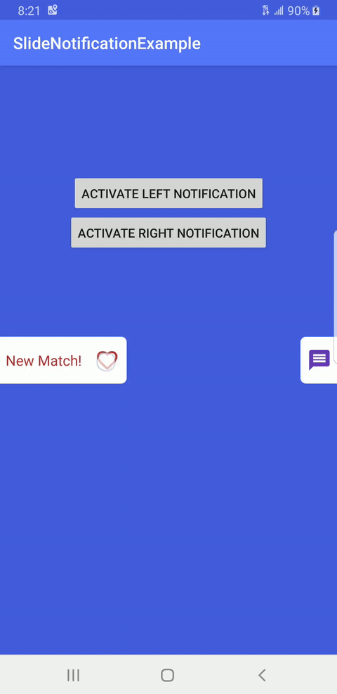
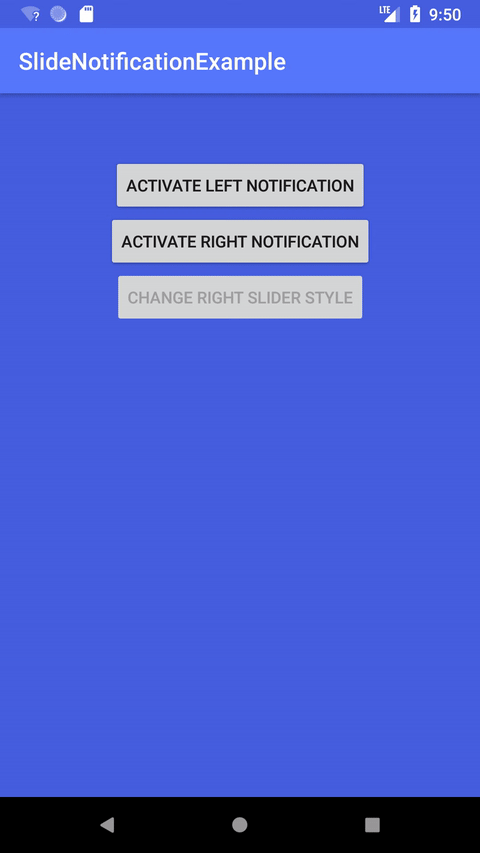

[](https://jitpack.io/#jpooleycodes/SlideNotificationView)
# Slide Notification View

This is a custom view written in Kotlin to use for visibly notifying the user of an event while inside the app.
I needed a way to notify users of an event but I did not want to block visibility of the top or bottom of the screen so I created this library.<br/><br/>



<br/>
## Getting Started

Add the dependency to you applications with JitPack in build.gradle file:

```groovy
implementation 'com.github.jpooleycodes:SlideNotificationView:533cf2c420'
```

Place the view in your layouts XML and position it on the edge of the screen:
```xml
<com.jpcodes.slidenotification.SlideNotificationView
    android:layout_width="wrap_content"
    android:layout_height="wrap_content"
    android:elevation="10dp"
    app:layout_constraintBottom_toBottomOf="parent"
    app:layout_constraintTop_toTopOf="parent"
    app:layout_constraintEnd_toEndOf="parent">
</com.jpcodes.slidenotification.SlideNotificationView>
```

When the view is collapsed, it can be swiped open or tapped to open it. Once fully open the view can be swiped back
to close it. If tapped while open you can detect that tap by using the OnSliderNotificationClickListener:

```java
rightSlideView.setSliderNotificationClickListener(object : OnSliderNotificationClickListener {
  override fun onSliderNotificationClicked() {
    Snackbar.make(mainLayout, "Right Notification Clicked", Snackbar.LENGTH_SHORT)
      .show()
    rightSlideView.close()
  }
})
```

## Customization

You can customize the view through XML attributes or programmatically. Example using some of the XML attributes:

```xml
<com.jpcodes.slidenotification.SlideNotificationView
    android:id="@+id/left_slide_notification_view"
    android:layout_width="wrap_content"
    android:layout_height="wrap_content"
    android:elevation="10dp"
    app:layout_constraintBottom_toBottomOf="parent"
    app:layout_constraintTop_toTopOf="parent"
    app:layout_constraintStart_toStartOf="parent"
    app:slideNotification_enableLeftSideLayout="true"
    app:slideNotification_enableAutoCollapse="false"
    app:slideNotification_notificationText="@string/notification_new_match"
    app:slideNotification_notificationTextColor="@color/colorRed"
    app:slideNotification_notificationBackgroundColor="@color/colorBackground"
    app:slideNotification_notificationIcon="@drawable/ic_favorite_border_red_24dp"
    app:slideNotification_topPercentDraggableLimit="5"
    app:slideNotification_bottomPercentDraggableLimit="5">
</com.jpcodes.slidenotification.SlideNotificationView>
```

Example of methods for customizing programmatically
``` kotlin
rightSlideView.setNotificationText(getString(R.string.notification_new_message))
rightSlideView.setNotificationIcon(getDrawable(R.drawable.ic_message_purple_24dp)!!)
rightSlideView.setNotificationTextColor(resources.getColor(R.color.colorDeepPurpleMaterial500))
rightSlideView.setBackgroundColor(resources.getColor(R.color.colorBackground))
rightSlideView.setDraggable(false)
rightSlideView.enableAutoCollapse(false)
rightSlideView.setTopPercentDraggableLimit(10)
rightSlideView.setBottomPercentDraggableLimit(10)
rightSlideView.setAutoCollapseTime(1000)
rightSlideView.open()
rightSlideView.close()
rightSlideView.collapse()
```

## Running the tests

There are Instrumented tests that verify the various behaviors of the view. The tests are part of the included
example app (NotificationSlideViewInstrumentedTest.kt). The tests can be executed within Android Studio.

## Build Info

```
compileSdkVersion 28
minSdkVersion 21
targetSdkVersion 28
```

## Authors

* **James Pooley** - *Initial work* - [jpooleycodes](https://github.com/jpooleycodes)

## License

This project is licensed under the MIT License - see the [LICENSE](LICENSE) file for details
